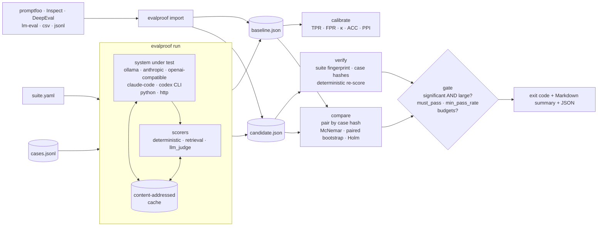

# Architecture

How a run flows from the suite and the dataset to the exit code.

```mermaid
flowchart LR
  suite[suite.yaml] --> runner
  data[(cases.jsonl)] --> runner
  subgraph runner[evalproof run]
    sys[system under test<br/>ollama · anthropic · openai-compatible<br/>claude-code · codex CLI<br/>python · http] --> scorers
    scorers[scorers<br/>deterministic · retrieval · llm_judge]
    cache[(content-addressed<br/>cache)]
    sys <--> cache
    scorers <--> cache
  end
  other[promptfoo · Inspect · DeepEval<br/>lm-eval · csv · jsonl] --> imp[evalproof import]
  runner --> run1[(baseline.json)]
  runner --> run2[(candidate.json)]
  imp --> run1
  imp --> run2
  run2 --> ver[verify<br/>suite fingerprint · case hashes<br/>deterministic re-score]
  run1 --> cal[calibrate<br/>TPR · FPR · κ · ACC · PPI]
  run1 --> cmp[compare<br/>pair by case hash<br/>McNemar · paired bootstrap · Holm]
  run2 --> cmp
  ver --> gate
  cmp --> gate{gate<br/>significant AND large?<br/>must_pass · min_pass_rate<br/>budgets?}
  gate --> out[exit code + Markdown summary + JSON]
```
